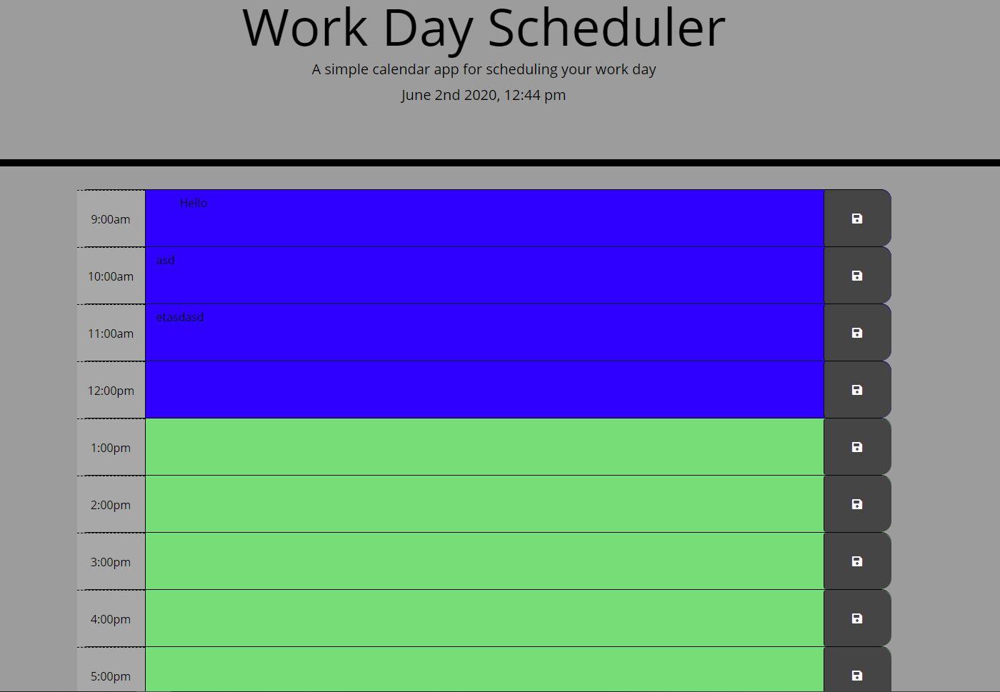

# DayScheduleX

This app will run in the browser and feature dynamically updated HTML and CSS powered by jQuery.
 
################################################
 
AS AN employee with a busy schedule
Add important events to your daily 9-5 schedule
This will help you manage your time effectively
 
################################################
 

Using the 9am-5pm work schedule
 
Select the hour/s you desire to schedule throughout the day
 
After you enter the plans
 
Simply click the save button to save
  

Below is an image displaying the schedule:

## Review

Here is the link to the application:
(https://bigmak88.github.io/DayScheduleX/)
